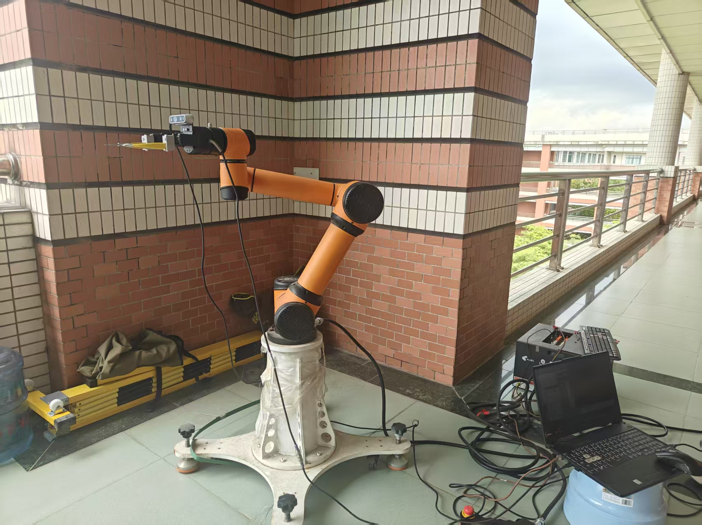
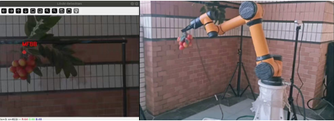
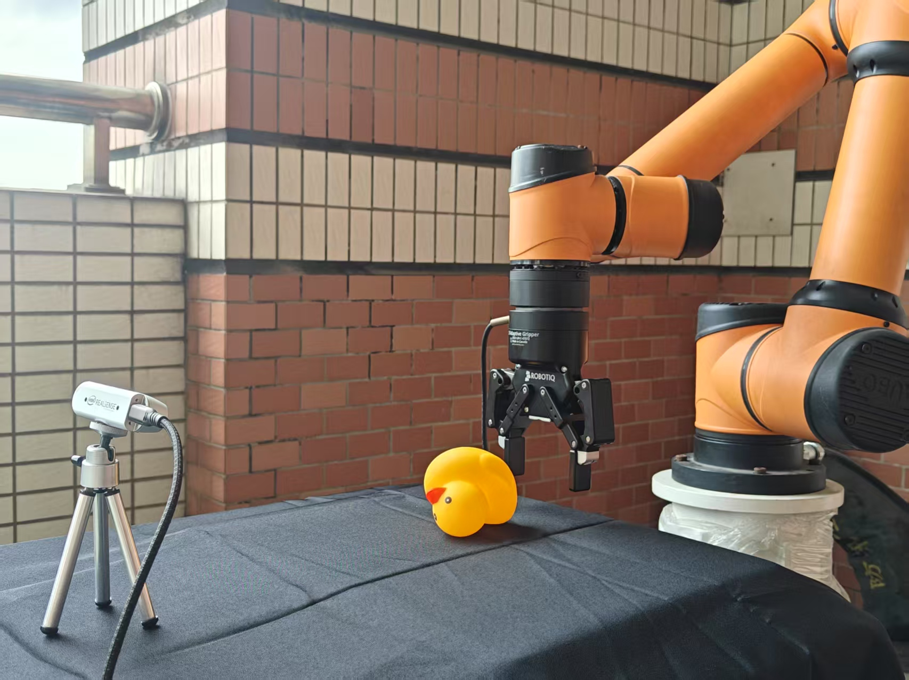

> ⚠️ **Note**: This repository includes some rough and debug-stage code. It is intended primarily for internal reference and academic sharing. Clean-up and modularization may be done in future updates.

A modular collection of ROS packages for various robotic tasks developed in our lab.  
Current implementations include:

- 🍒 **Litchi Grasp**: Vision-based litchi fruit picking via stem-fruit association.

- 🤖 **RL Lift Task**: Reinforcement learning implementation for the Lift task.

- ......

  

🧱 **Experimental Setup**: Ubuntu 20.04 / ROS Noetic · Aubo-i5 · Robotiq 2F-85 · RealSense D435i


### 🔧 Build and Setup

```bash
catkin build
source devel/setup.bash
```

**Aubo i5**

*simulation*

```bash
roslaunch aubo_i5_moveit_config moveit_planning_execution.launch sim:=true robot_ip:=127.0.0.1
```

*real robot*

```bash
roslaunch aubo_i5_moveit_config moveit_planning_execution.launch sim:=false robot_ip:=192.168.1.100
```

**Robotiq 2f-85**

*simulation*

```bash
roslaunch robotiq_2f_85_gripper_visualization test_2f_85_model.launch
```

```bash
rosrun robotiq_2f_gripper_control Robotiq2FGripperRtuNode.py /dev/ttyUSB0
rosrun robotiq_2f_gripper_control Robotiq2FGripperSimpleController.py
```


## 🍒 Litchi Grasp



The litchi picking module is implemented in the `litchi_grasp` package.

### 📦 Recognition Method

- By default, the model is used directly to perform recognition.
- For ONNX model inference, refer to the logic in `rl_test/get_duck.py`.

---

### 🧭 Picking Procedure

1. **Launch the robot arm (simulation or real, see above)**
2. **Start the RealSense camera service node:**
3. **Start the picking execution node:**

```bash
rosrun litchi_grasp get_litchi.py
rosrun litchi_grasp grasp
```


## 🤖 RL Lift Task

The reinforcement learning Lift task is implemented in the `rl_test` package.



### 📦 Execution Method

- The RL policy is loaded from a `.pt` file (PyTorch format).
- Actions are generated and executed using the trained policy.

---

### 🧭 Execution Procedure

1. **Launch the robot arm (simulation or real, see above)**

2. **Start the RealSense camera service to obtain object information**  
   (or manually provide target state):

3. **Start the RL action inference node:**

4. **Start the main execution node:**

```bash
rosrun rl_test get_duck.py
rosrun rl_test rl2action.py
rosrun rl_test rl_lift
```